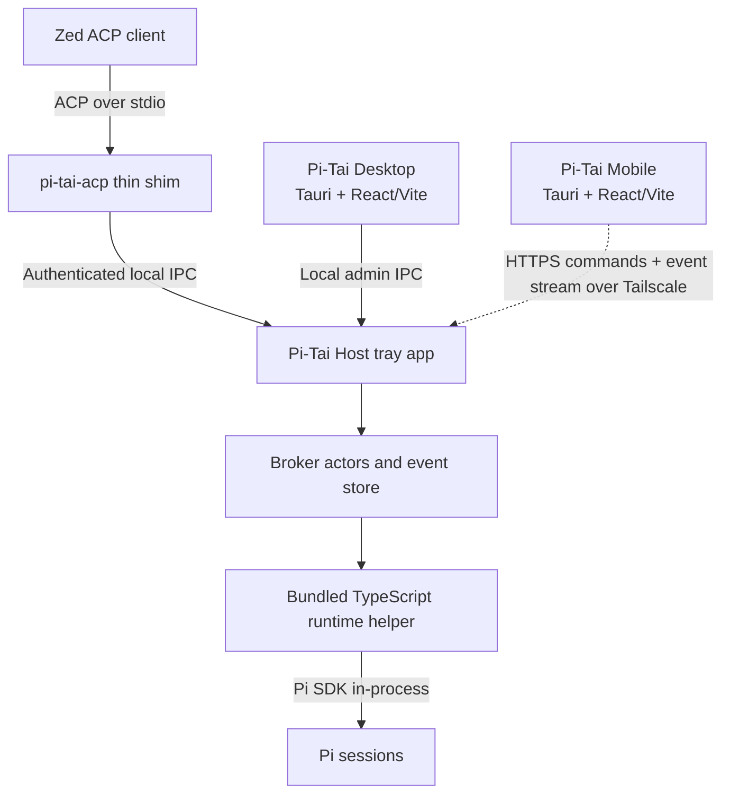

# Pi-Tai Host and Companion Architecture

## Status

Stage 2 design approved. The proof-first execution plan is defined in [STAGE2_HOST_IMPLEMENTATION_PLAN.md](STAGE2_HOST_IMPLEMENTATION_PLAN.md). Production Host and ACP hardening remains gated on review of the architecture proofs.

This document defines Pi-Tai's Pi-specific companion architecture. Pi is the only initial agent runtime. Zed, desktop, and mobile are clients of one broker-owned Pi session rather than independent session owners.

## Product direction

Pi-Tai should grow from a terminal distribution into a local-first Pi platform:

- Pi-Tai terminal remains useful on its own.
- Pi-Tai Host owns sessions that need to survive client disconnection.
- Zed attaches through a thin ACP shim.
- A desktop application configures the product and reports host/session status.
- A future mobile application observes and controls the same host-owned sessions.
- Future chat, web, terminal, and T3 clients can use the same product API or an appropriate protocol adapter.

The core promise is:

> Start a Pi session from Zed or mobile, leave either client, and continue observing and controlling one authoritative thread from another client.

## Initial architecture



There is no generic downstream ACP connection in the initial design. ACP is the Zed-facing adapter; the actual runtime uses Pi's SDK.

## Deployable components

### Pi-Tai Host Agent

Pi-Tai Host Agent is a separately running Tauri tray application, not an operating-system daemon. It is the authority for remotely attachable sessions.

Responsibilities:

- own broker session identities and lifecycle;
- serialize commands through one actor per session;
- supervise the bundled Pi runtime helper;
- persist normalized events, snapshots, revisions, and client attachments;
- retain active sessions when Zed, the desktop manager, or mobile disconnects;
- serve authenticated local IPC to the ACP shim and desktop manager;
- later serve a versioned mobile API through a localhost listener exposed by Tailscale Serve;
- show basic health and active-session state from its tray menu;
- warn before quitting while turns are active.

Lifecycle policy:

- Pi-Tai Desktop may launch the host and configure launch at login.
- Exiting Pi-Tai Desktop does not stop the host.
- Closing or crashing a React/WebView window does not intentionally stop the host process.
- A complete host-process crash may interrupt an active turn. On restart, history is recovered and the session is resumed or loaded when Pi supports it; the interrupted turn is reported honestly.
- Transparent survival of an in-flight turn across a host-process crash is not an initial requirement.

A tray application avoids a separately installed LaunchAgent/service for the first release. A true background service can be reconsidered only if reliability data justifies its packaging and operational cost.

### TypeScript Pi runtime helper

Tauri's application core is Rust, while Pi's SDK is TypeScript. The initial design therefore bundles a TypeScript runtime helper with Pi-Tai Host.

Responsibilities:

- load Pi through its SDK in-process;
- load Pi-Tai extensions and configuration;
- create, resume, and close Pi sessions;
- stream Pi lifecycle, message, tool, title, usage, and work-context events to the host;
- accept serialized prompt, steering, cancellation, and configuration commands from the host.

The helper is an implementation detail of the signed Host application, not a separately installed user service. The host supervises it and treats helper termination as a runtime interruption. Packaging the helper as a self-contained executable is preferred so users do not manage a Node installation.

The architecture proof must validate this boundary before the product API freezes. Spawning `pi --mode rpc` remains a fallback for validation only, not the target architecture.

### `pi-tai-acp`

The executable configured as a Zed external agent is deliberately thin.

Responsibilities:

- implement ACP initialization and capability negotiation;
- translate Zed requests into host IPC commands;
- attach a Zed connection to broker sessions;
- relay live and replayed host events as semantic ACP updates;
- expose broker session list/load/resume/close behavior;
- report actionable host-not-running and version-mismatch errors.

The shim owns no durable state and does not launch Pi. Zed may terminate it without terminating the broker session.

### Pi-Tai Desktop

Pi-Tai Desktop is a Tauri application using React and Vite. Its first release is a manager, not another full chat client.

Initial configuration surface:

- host installation, startup, version, and health;
- Pi authentication and model readiness;
- working model visibility;
- title provider, model, effort, and fallback;
- Guardian configuration and readiness;
- Zed external-agent setup;
- launch-at-login behavior;
- Tailscale readiness and mobile pairing later.

Initial session status surface:

- title and stable broker session ID;
- workspace;
- model;
- working, waiting, completed, interrupted, or failed state;
- connected client kinds;
- current active client;
- last activity.

Prompting, plan editing, transcript review, archiving, and arbitrary session control are deferred until their broker commands and concurrency semantics exist. The manager may expose diagnostics and safe restart controls early.

### Pi-Tai Mobile

Pi-Tai Mobile will use Tauri Mobile with React and Vite rather than React Native. It can share API types, state logic, design tokens, and selected responsive components with the desktop application.

The first mobile slice is an authenticated observer. Control, plan editing, permissions, mobile-created sessions, worktrees, diffs, and notifications follow as separate slices.

## Session ownership and concurrency

Every broker session has one serialized actor. API handlers and protocol adapters enqueue commands rather than mutating session state directly.

The actor owns:

- stable broker session identity;
- Pi session identity and runtime generation;
- current session and turn state;
- ordered event sequence and revision;
- connected client attachments;
- active-client attribution and control epoch;
- pending questions or permissions;
- command idempotency records;
- current goal and plan projection.

Every authorized client may observe and submit supported interactions. An accepted state-changing command immediately makes its client the active client; there is no confirmation-based takeover policy. The Host serializes commands, deduplicates operation IDs, and rejects stale expected revisions. A control epoch remains useful for attribution and invalidating delayed work, but is not a permission lease.

Concurrent commands based on the same revision do not both win: the first durable command advances the revision and the other receives a conflict with current state. Cancellation and interaction answers target durable IDs and are idempotent.

Only one prompt turn may run per session. Follow-up text may be retained as a local draft, but the host does not silently enqueue a second turn.

## Goal and plan ownership

ACP can present plans to Zed but does not define a general client-to-agent plan editor. External plan edits therefore use a Pi-Tai product command rather than a custom assumption about ACP.

A plan-changing command contains:

```ts
{
  operationId: string;
  sessionId: string;
  expectedRevision: number;
  clientId: string;
  goal?: string;
  explanation?: string;
  plan: Array<{
    content: string;
    status: "pending" | "in_progress" | "completed";
    priority?: "high" | "medium" | "low";
  }>;
}
```

The host validates authority and transitions, persists the complete replacement state, emits it to all clients, records it in Pi's durable session context, and makes the user-originated change visible to the model. Exact steering behavior during an active turn remains an implementation decision and must not silently rewrite context the model cannot observe.

Terminal and hosted operation should share a storage interface:

```text
WorkContextStore
├── PiSessionWorkContextStore     # standalone terminal session
└── BrokerWorkContextStore        # host-owned multi-client session
```

## Persistence and recovery

The host uses SQLite in WAL mode as the sole owner of broker product state. Pi session files remain the durable model transcript and are mapped to broker session IDs.

Normalized events are canonical for cross-client replay and presentation. Raw ACP or Pi logs are diagnostic artifacts, not the mobile API contract.

The UI distinguishes:

- a client disconnect while Pi continues;
- a runtime-helper interruption;
- a complete host interruption;
- a recoverable historical session;
- a non-resumable interrupted turn.

A successful command acknowledgement implies its durable broker command/event record exists. It does not promise that an operating-system crash cannot interrupt a tool already executing.

## Shared application code

Recommended layout after the repository becomes a workspace:

```text
apps/
├── desktop/                 # Tauri + React/Vite manager
├── host/                    # Tauri tray application
└── mobile/                  # Tauri Mobile + React/Vite, later
bins/
└── acp/                     # thin Zed ACP shim
services/
└── pi-runtime/              # TypeScript, Pi SDK in-process
packages/
├── pi-tai/                  # terminal extensions and themes
├── api-types/
├── api-client/
├── session-model/
└── ui/
crates/
├── broker/
├── event-store/
├── local-ipc/
├── companion-client/
├── device-auth/
└── diagnostics/
```

Desktop and mobile should share API and product semantics, but neither serializes internal broker domain structs directly. Rust/product API DTOs and TypeScript types require an explicit generation or mapping boundary.

## Delivery slices

1. **Terminal refresh:** complete and manually accept standalone Pi-Tai.
2. **Architecture proof:** validate Tauri tray lifecycle, bundled TypeScript Pi SDK helper, local IPC, Zed launch, event ordering, disconnection, and recovery.
3. **Durable host kernel:** one actor, SQLite events, one Pi session, replay, idempotent commands, and diagnostic CLI.
4. **Zed continuity:** thin ACP shim, session discovery/load, rich output, plans, titles, models, Guardian, and cancellation.
5. **Desktop manager:** configuration, health, Zed setup, and session status.
6. **Remote observer:** Tailscale, device pairing, snapshots, event stream, and Tauri mobile inbox/timeline.
7. **Remote control:** immediate cross-client handoff, prompts, cancellation, plan edits, questions, and permissions.
8. **Remote creation and review:** repository registry, managed worktrees, diffs, durable history, and notifications.

No implementation in slices 2–8 starts before terminal manual acceptance.

## Initial non-goals

- Supporting arbitrary downstream ACP agents.
- Sharing or editing Zed's private database.
- Keeping an in-flight tool operation alive after the complete Host application crashes.
- A full desktop or mobile code editor.
- React Native.
- Public-internet exposure without Tailscale.
- Automatic merges or pull requests.
- Making every standalone terminal Pi session remotely visible.

## Decisions recorded

- Pi is the only initial runtime.
- Host-owned sessions are authoritative for multi-client use.
- Pi-Tai Host Agent is a macOS-first Tauri tray application rather than an installed daemon, with portable core crates and platform adapters for later Windows and Linux support.
- Pi-Tai Desktop manages configuration and may start the Host automatically.
- A thin ACP shim connects Zed to the Host.
- The Host uses Pi's SDK through a bundled TypeScript runtime helper.
- Desktop and mobile use Tauri with React and Vite.
- Mobile uses a product API rather than raw ACP.
- Tailscale remains the intended first remote network boundary.
- Host crash recovery prioritizes durable history and honest interrupted-state reporting over transparent in-flight continuation.
- Every authorized client may mutate supported session state; the Host serializes commands and transfers active-client attribution immediately without a takeover policy.
- Runtime sessions unload after 30 eligible idle minutes and reload from durable state on demand.
- The initial product is local-only, authenticated, and has no telemetry or public listener.

## Open decisions

- Whether the future Desktop manager and Host Agent ship as two visible application bundles or one user-facing bundle containing separate executables; one user-facing installation is currently assumed.
- Exact packaging technology for the self-contained TypeScript Pi runtime helper.
- Exact user-visible application names.
- Exact model-visible steering behavior when an authorized client immediately replaces plan state during an active turn; Host-authoritative replacement with explicit model notification is currently recommended.
- First mobile control milestone after observer mode.
- Exact Luna provider/model IDs.
