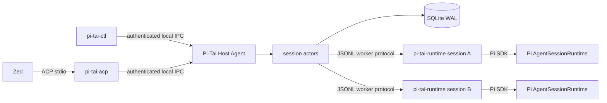

# Stage 2 Host and Zed Implementation Plan

## Status

Design pass approved. H0 workspace/protocol contracts, the H1 Tauri Host Agent lifecycle proof, and the H2 Pi SDK runtime-worker proof are implemented; H3 Host-to-worker supervision is next. Terminal Pi-Tai session-title tuning may continue independently if needed.

Stage 2 proceeds through disposable architecture proofs. Production Host and ACP implementation starts only after those proofs are reviewed.

Accepted architecture decisions:

- [ADR 0001: Host Agent owns durable sessions](adr/0001-host-process-ownership.md)
- [ADR 0002: Valid mutations transfer active-client control immediately](adr/0002-immediate-client-control.md)
- [ADR 0003: Unload idle runtimes and recover interrupted turns explicitly](adr/0003-runtime-idle-and-recovery.md)
- [ADR 0004: macOS-first shell with a portable core](adr/0004-macos-first-portable-core.md)
- [ADR 0005: Package the runtime worker as a Bun standalone executable](adr/0005-runtime-worker-packaging.md)

## Product decisions from the design pass

### Platform strategy

- The first supported alpha is macOS.
- Host UI and tray lifecycle use Tauri so the application shell remains portable.
- Broker, event-store, protocol, and runtime-supervision logic must not depend on macOS or Tauri types.
- Operating-system behavior sits behind small adapters for application launch, launch at login, secure storage, local IPC, filesystem paths, and process signaling.
- macOS adapters are implemented first. Windows named pipes, Credential Manager, and startup integration, plus Linux sockets, secret storage, and autostart, remain later adapters rather than reasons to redesign the broker.

### Process and installation shape

The implementation uses separate process boundaries:

```text
Pi-Tai installation
├── Pi-Tai Host Agent        Tauri tray process and broker authority
├── pi-tai-runtime           one supervised TypeScript/Pi worker per loaded session
├── pi-tai-acp               disposable Zed adapter
└── pi-tai-ctl               diagnostic client
```

The preferred distribution is one user-facing Pi-Tai installation containing these executables. Whether macOS ultimately exposes a separate manager application bundle remains a packaging decision for the later Desktop stage.

The background component is called **Pi-Tai Host Agent** in user-facing text. It is not described as an operating-system service or daemon. `Vite` remains frontend build tooling and is not part of the product name.

### Host startup

- `pi-tai-acp` first attempts authenticated local connection.
- If the Host Agent is installed but stopped, the shim may launch it and wait for a bounded readiness handshake.
- The shim never creates or owns a Pi runtime directly.
- If launch or negotiation fails, Zed receives an actionable host-not-running, incompatible-version, or startup-failed error.
- Launch at login is opt-in.
- Closing a manager window does not stop the Host Agent.
- Quitting the Host Agent is explicit and warns while turns or unresolved interactions exist.

### Session idling

A broker session becomes unload-eligible after 30 minutes with:

- no active or queued Pi turn;
- no pending question or permission;
- no command being durably applied;
- no recovery operation in progress.

Client attachments do not prevent unload. Unload disposes the in-process Pi runtime and terminates that session's runtime worker, but retains broker state, normalized events, snapshots, title, work context, and Pi session-file mapping. The next runtime-requiring command transparently reloads the session.

A session remains listed until explicitly deleted according to future retention controls.

### Equal clients and immediate control transfer

The Host Agent—not ACP, Zed, desktop, or mobile—owns all authoritative state.

Every authenticated client may observe and submit supported interactions. There is no user-configurable takeover policy and no confirmation dialog between the same user's devices.

The broker retains `activeClientId` and `controlEpoch` for attribution, routing, and rejection of delayed work, but control is not a permission lease:

1. A state-changing command arrives with `clientId`, `operationId`, and `expectedRevision`.
2. The session actor authenticates, deduplicates, and serializes it.
3. If its revision and interaction preconditions are valid, acceptance atomically records any control transfer and the command.
4. The accepted client becomes active immediately and the control epoch increments when the active client changes.
5. Concurrent commands based on the same revision do not both win. The first durable command advances the revision; the other receives a conflict plus the latest revision/snapshot and may retry intentionally.

Cancellation and answers target a specific turn, question, or permission ID and are idempotent. The first valid resolution wins; delayed competing resolutions are reported as already resolved rather than forwarded to Pi.

Only one prompt turn runs per session. The Host does not silently queue a second prompt. Steering and follow-up are separate explicit command types when implemented.

This supports the primary handoff workflow:

1. Start work from Zed.
2. Walk away while the Host continues the turn.
3. Cancel or answer an interaction from mobile.
4. Return to Zed and submit the next command, immediately making Zed the active client again.

### Recovery and privacy

- Client disconnect never implies Pi cancellation.
- Runtime-worker or Host failure during a turn records an interrupted state.
- The last prompt is not automatically replayed because tools may already have produced side effects.
- The user explicitly continues from recovered history.
- Product data is local only in Stage 2.
- There is no telemetry, cloud account, public listener, or mobile network endpoint.
- Local IPC is authenticated even on the same machine.
- Tailscale and device pairing remain disabled until the remote-observer stage.

## Target architecture



### Host Agent

The Tauri process owns:

- tray lifecycle and user-visible health;
- the authenticated local IPC listener;
- broker session actors;
- SQLite connection and migrations;
- runtime-worker supervision;
- protocol/version negotiation;
- launch and quit policy.

Tauri commands and tray callbacks enqueue broker commands. They do not mutate session state directly.

### Session actor

One actor per broker session owns:

- stable broker session ID;
- Pi session file/ID and runtime generation;
- session lifecycle and active turn;
- ordered event sequence and state revision;
- authenticated attachments and replay cursors;
- active-client attribution and control epoch;
- operation deduplication;
- pending question/permission identities;
- title, model, usage, and work-context projections;
- idle-unload deadline.

### Runtime worker

The initial proof uses one worker process per loaded broker session. This isolates Pi SDK global state and makes idle unload and crash attribution explicit. The proof may reject this choice if measured startup or memory costs are unacceptable.

The worker uses Pi's SDK rather than CLI RPC:

- `createAgentSessionRuntime()` for session replacement;
- `createAgentSessionServices()` and `createAgentSessionFromServices()` for cwd-bound resources;
- `SessionManager.create/open()` for persistent Pi history;
- `DefaultResourceLoader`/inline extension loading for Pi-Tai;
- `AgentSession.subscribe()` for semantic lifecycle events;
- re-subscription after runtime session replacement.

The worker owns no broker database and does not accept client connections.

### Thin ACP shim

`pi-tai-acp` owns only:

- ACP stdio transport and capability negotiation;
- Host launch/connect/version handshake;
- request-to-Host command translation;
- Host event replay/live translation into ACP updates;
- Zed-appropriate errors and shutdown.

Killing the shim detaches Zed and leaves the Host session unchanged.

## Cross-platform boundaries

Portable Rust crates must compile without Tauri:

```text
crates/
├── broker/             session actor and command arbitration
├── event-store/        SQLite schema, migrations, replay, snapshots
├── host-protocol/      commands, events, versions, errors
├── local-ipc/          transport-neutral connection/auth contracts
├── runtime-supervisor/ worker lifecycle and JSONL protocol
└── diagnostics/        redaction and health projections
```

Platform adapters implement:

| Capability | macOS first | Future Windows | Future Linux |
|---|---|---|---|
| Local IPC | Unix-domain socket | Named pipe | Unix-domain socket |
| Secure token | Keychain | Credential Manager | Secret Service/keyring |
| App launch | Launch Services/open | ShellExecute/app registration | desktop entry/process launch |
| Login startup | Tauri/macOS adapter | startup/task adapter | XDG autostart/system adapter |
| Paths | platform app-data API | platform app-data API | XDG paths |
| Signals | Unix process groups | job/process APIs | Unix process groups |

No core module may construct a macOS path, invoke `open`, or depend on a Tauri window/tray handle.

## Protocol baseline

### Client command envelope

```ts
interface HostCommand<T> {
  protocolVersion: number;
  requestId: string;
  operationId: string;
  clientId: string;
  sessionId?: string;
  expectedRevision?: number;
  kind: string;
  payload: T;
}
```

A successful acknowledgement means the operation's durable command/event record exists. It does not claim that every external tool side effect is crash-transactional.

### Host event envelope

```ts
interface HostEvent<T> {
  protocolVersion: number;
  sessionId: string;
  sequence: number;
  revision: number;
  runtimeGeneration: number;
  timestamp: string;
  type: string;
  payload: T;
}
```

`sequence` orders replay. `revision` protects state-changing commands. `runtimeGeneration` prevents delayed events from a replaced worker being accepted as current.

### Runtime-worker protocol

The proof starts with framed JSON Lines over worker stdin/stdout:

Commands:

- `runtime.initialize`
- `session.create`
- `session.open`
- `session.prompt`
- `session.steer`
- `session.follow_up`
- `session.cancel`
- `session.set_model`
- `session.set_thinking`
- `session.dispose`
- `runtime.shutdown`

Events:

- `runtime.ready`
- `session.ready`
- `session.event`
- `session.replaced`
- `session.idle`
- `session.interrupted`
- `runtime.error`

stdout is protocol-only. Diagnostics go to stderr as structured, redacted records.

## Persistence baseline

SQLite runs in WAL mode and is solely owned by the Host Agent.

Initial tables/projections:

- `broker_sessions`
- `session_events`
- `session_snapshots`
- `operations`
- `attachments`
- `runtime_generations`
- `pending_interactions`
- `schema_migrations`

Required invariants:

- `(session_id, sequence)` is unique and monotonic;
- `operation_id` is unique within its documented scope;
- state revision advances only inside the durable actor transaction;
- replay from a cursor is deterministic and duplicate-free;
- snapshots are disposable accelerators, not the only history;
- raw Pi/ACP payloads are diagnostic attachments, not product state;
- secrets and private tool content are not copied into general diagnostics.

## Implementation sequence

Every slice follows red → green → refactor → checkpoint.

### H0: workspace and contract fixtures

#### Red

- Repository-shape assertions for Rust, TypeScript, and application boundaries.
- Cross-language fixture tests for command/event envelopes.
- Version-negotiation and structured-error fixtures.
- Tests proving core crates do not depend on Tauri.

#### Green

- Add Cargo and npm workspace plumbing without moving the existing Pi package contract.
- Add `host-protocol` Rust types and mapped/generated TypeScript fixtures.
- Add architecture decision records for process ownership, immediate control transfer, idle unload, and recovery.

#### Acceptance

- Existing `pi install`/`just pitai` behavior remains unchanged.
- Rust and TypeScript decode the same fixtures.

#### Checkpoint

```text
build(host): establish workspace and protocol contracts
```

### H1: Tauri Host Agent lifecycle proof

#### Red

- Tray process remains alive when an optional proof window closes.
- Explicit quit produces an active-turn warning decision.
- A second launch discovers or focuses the existing Host Agent instead of creating a second broker authority.
- Platform adapter unit tests run without Tauri.

#### Green

- Scaffold the macOS-first Tauri Host Agent.
- Implement tray health, open diagnostics, and quit actions.
- Add a single-instance/readiness mechanism.
- Keep all OS operations behind adapter traits.

#### Acceptance

- Closing every WebView leaves the tray process and proof IPC endpoint alive.
- The portable crates compile independently of the application shell.

Proof procedure and manual tray checks: [H1_HOST_LIFECYCLE.md](proofs/H1_HOST_LIFECYCLE.md).

#### Checkpoint

```text
feat(host): prove tray-owned lifecycle
```

### H2: Pi SDK runtime-worker proof — implemented

#### Red

- Rust-first Serde/Specta runtime DTOs generate drift-checked TypeScript contracts paired with Zod schemas that share fixtures with Rust.
- Fake-model prompt streams ordered text and lifecycle events.
- Pi-Tai extension tools and commands load through SDK resources.
- Persistent session create/open works.
- Session replacement rebinds subscriptions.
- Worker stdout rejects non-protocol output.
- SIGTERM and cancellation dispose the runtime cleanly.

#### Green

- Add `crates/runtime-protocol` as the structural DTO source and generate checked-in bindings under `packages/runtime-protocol`.
- Add `services/pi-runtime`.
- Build `AgentSessionRuntime` through Pi's SDK.
- Implement minimal worker JSONL framing.
- Use a fake/local provider in automation; no paid model calls.
- Compare Bun standalone, Node SEA, and another viable self-contained packaging route before selecting one.

#### Acceptance

- A Bun standalone worker creates a persistent Pi session, runs deterministic faux prompts and tools, emits semantic events, closes, reopens, continues history, cancels, and survives signal shutdown without a user-managed runtime or repository files.
- The private Node sidecar also passes as a fallback; the Node SEA candidate is rejected after crashing before initialization.

Detailed proof plan and recorded evidence: [H2_RUNTIME_WORKER_PLAN.md](proofs/H2_RUNTIME_WORKER_PLAN.md) and [ADR 0005](adr/0005-runtime-worker-packaging.md).

#### Checkpoint

```text
feat(runtime): prove hosted Pi SDK sessions
```

### H3: Host-to-worker and disconnect proof

#### Red

- Host starts, handshakes, and supervises one worker.
- Worker events carry the current runtime generation.
- Killing a diagnostic client does not cancel the worker turn.
- Killing the worker marks an active turn interrupted.
- Delayed events from an old worker generation are rejected.

#### Green

- Connect the Host Agent proof actor to the runtime worker.
- Add authenticated local IPC on a macOS Unix-domain socket.
- Add `pi-tai-ctl` commands for health, create, prompt, observe, cancel, and detach.

#### Acceptance

- `pi-tai-ctl` starts a turn, disconnects, reconnects from an event cursor, and receives the remaining ordered events.

#### Checkpoint

```text
feat(host): preserve turns across client disconnects
```

### H4: durable broker and recovery proof

#### Red

- Durable acknowledgement and operation deduplication.
- Competing same-revision commands: one winner and one conflict.
- Immediate active-client transfer on an accepted mutation.
- Idempotent cancellation and interaction resolution.
- Snapshot plus event replay equivalence.
- Host restart after idle, active turn, and worker crash.
- 30-minute eligibility using an injected clock.

#### Green

- Add SQLite WAL event store and minimal session projection.
- Persist command acceptance and normalized events transactionally.
- Implement active-client attribution/control epochs without a takeover policy.
- Implement runtime unload/reload and honest interruption states.

#### Acceptance

- Restart reconstructs the same broker projection.
- An interrupted prompt is not replayed automatically.
- Idle unload preserves history and transparently reloads on the next command.

#### Checkpoint

```text
feat(broker): add durable sessions and recovery
```

### H5: ACP and Zed behavior proof

#### Red

- ACP initialize/capability fixtures.
- Host auto-launch, unavailable, timeout, and version-mismatch tests.
- New/list/load/close/prompt/cancel translation tests.
- Disconnect/reconnect without session cancellation or duplicate replay.
- Independently authored native-plan fixtures based on current Zed/Codex behavior research.

#### Green

- Add a minimal official-SDK `pi-tai-acp` proof.
- Translate only proof-level text, tool lifecycle, plan, title, and errors.
- Keep all state in the Host Agent.

#### Acceptance

- Zed launches the shim, the shim starts/connects Host, and one Host-owned Pi session survives Zed disconnection and reload.
- Zed renders the selected plan fixture as intended.

#### Checkpoint

```text
feat(acp): prove Zed continuity through Host
```

### Gate H: architecture-proof review

Stop before hardening the production alpha. Review:

- Host Agent packaging and tray behavior;
- per-session worker startup time and memory;
- self-contained worker packaging choice;
- local IPC and secure-token behavior;
- SQLite replay and crash results;
- immediate cross-client control conflicts;
- Zed launch, plan rendering, and reconnect behavior;
- cross-platform boundaries and macOS-specific leakage.

### H6: production Host kernel

- Harden actor mailbox, operation ledger, migrations, snapshots, replay cursors, redaction, runtime supervision, and idle unload.
- Add property/state-machine tests for command ordering and recovery.

Checkpoint:

```text
feat(broker): harden the Host session kernel
```

### H7: production Host Agent and diagnostics

- Finalize tray UX, launch readiness, active-turn quit warnings, health projections, structured logs, and `pi-tai-ctl`.
- Keep launch-at-login opt-in.

Checkpoint:

```text
feat(host): ship the macOS Host Agent alpha
```

### H8: production thin ACP shim

- Implement the accepted P0 Zed flows from [ACP_SCOPE.md](ACP_SCOPE.md).
- Add rich tools, diffs, locations, terminal output, native plans, titles, models, effort, commands, Guardian presentation, and auth-required behavior in reviewable slices.

Suggested checkpoints:

```text
feat(acp): add Host-backed session lifecycle
feat(acp): translate rich Pi tools and output
feat(acp): add native plans and live titles
feat(acp): add models commands and Guardian flows
```

### Gate Z: Host and Zed acceptance

Verify the complete checklist in [IMPLEMENTATION_PLAN.md](IMPLEMENTATION_PLAN.md) before Desktop or mobile work begins.

## Automated test strategy

- Rust unit and integration tests use temporary directories and injected clocks/process launchers.
- Cross-process tests use fake runtime workers before Pi SDK workers.
- Pi SDK tests use fake/local providers and isolated agent/settings directories.
- TypeScript protocol tests consume the same checked-in fixtures as Rust tests.
- ACP tests use in-memory transports before Zed smoke tests.
- Crash tests kill client, worker, and Host processes independently.
- No test requires a paid model, global Pi extensions, real Keychain secrets, or the user's session directory.
- macOS tray behavior and Zed rendering retain explicit manual checks where automation cannot establish presentation quality.

## Remaining decisions for proof results

These are engineering choices to be decided from measurements rather than preference:

- Bun standalone versus Node SEA or another runtime-worker package.
- Per-session worker versus shared worker if startup/memory evidence rejects the isolation default.
- Exact macOS secure-storage library and launch-at-login adapter.
- Final local-IPC framing after JSONL proof measurements.
- Snapshot frequency and event-retention tuning.
- Minimum supported macOS version.

One product packaging question remains for the Desktop stage: whether the future manager and Host Agent appear as one application bundle or two visible bundles. The current implementation plan assumes one user-facing installation with separate internal executables.
