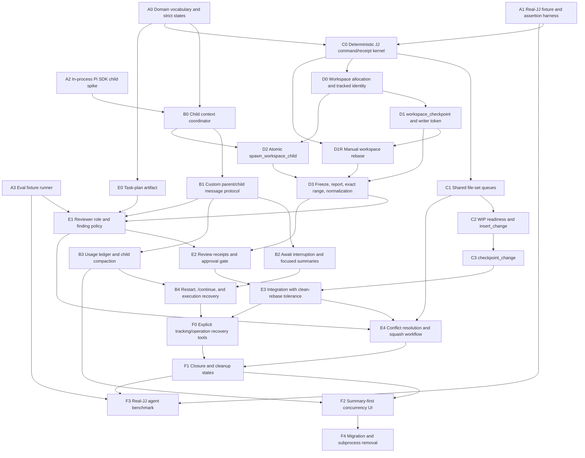

# Agent concurrency implementation DAG

This is a dependency graph, not a single linear implementation plan. Each slice must be independently reviewable, tested, and checkpointed. A slice may start when all incoming dependencies are complete.

## Graph

## Milestones

| Milestone | Slices | Product proof |
|---|---|---|
| M0 Foundations | A0–A3 | Strict domain/JJ operation contracts, real-JJ harness, SDK feasibility, opt-in eval runner |
| M1 In-process child runtime | B0–B4 | Private SDK children push bounded messages, compact, interrupt waits, and resume recursively |
| M2 Shared-source concurrency | C0–C3 | `insert_change` and locked `checkpoint_change` produce deterministic shared history |
| M3 Isolated workspace execution | D0–D3 + D1R | Workspace root/head are tracked exactly; coherent work checkpoints and the owned range can be manually rebased |
| M4 Review and integration | E0–E4 | Task plan→reviewer→approval→integration→bounded conflict repair |
| M5 Recovery and dogfood | F0–F4 | User-directed recovery, closure/UI, optional benchmarks, migration, subprocess removal |

M1, M2, and the early parts of M3 can progress in parallel after M0.

## Slice contracts

### A0 — Domain vocabulary and strict states

**Depends on:** none

- Add semantic IDs for root session, child context, execution cycle, event, workspace, file-set claim, JJ operation, review, integration, and recovery authorization.
- Add strict unions from `INVARIANTS.md`.
- Define semantic `JjOperations` capability interfaces over opaque tracked source/workspace handles and claims/leases.
- Separate persistence DTO migration from internal domain objects.
- Encode exactly-once event acknowledgement and usage attribution.

**Exit:** invalid combinations cannot be constructed internally; migration fixtures quarantine ambiguous legacy states.

### A1 — Real-JJ fixture and assertion harness

**Depends on:** none

- Add the structured `JjProcessExecutor`, exact `0.43.0` probe, scripted executor, and long-form-command contracts.
- Build temp-repository lifecycle, normalized snapshots, seeded graph/workspace helpers, and operation-log retention.
- Pin exact JJ `0.43.0` for the initial runtime and primary CI contract.
- Add exact Change-ID and normalized-patch assertion helpers.

**Exit:** one model-free test proves a real JJ before/tool-call/after assertion and fails with a retained diagnostic fixture.

### A2 — In-process Pi SDK child spike

**Depends on:** none

- Create two concurrent child `AgentSession` objects in one root process.
- Give each a custom resource loader, model/tools/cwd, private session directory, and inline bridge.
- Prove root and child can send custom messages without user-role impersonation.
- Confirm private child sessions do not appear in normal session listing.

**Exit:** feasibility test covers concurrent streaming, cancellation, and disposal with no subprocess.

### A3 — Eval fixture runner

**Depends on:** none

- Define stable YAML/JSON cases, expected/forbidden tools, lifecycle assertions, and rubric hooks.
- Support dry/model-free tool-selection fixtures and opt-in live `pi -ne -e .` cases.
- Keep model output separate from deterministic repository assertions.

**Exit:** the runner validates and dry-runs one no-JJ case and one Real-JJ agent case through the same report format; executing live models remains opt-in and non-gating.

### B0 — Child context coordinator

**Depends on:** A0, A2

- Own root-scoped child SDK contexts, parent links, private file-backed journals, cancellation, heartbeats, and execution cycles.
- Cut every new launch to in-process SDK contexts; retain PID/FIFO records only for inspect/cancel/recovery compatibility.
- Expose typed create/get/list operations and exact clean-closure journal retention.

**Exit:** nested private contexts survive coordinator-controlled disposal/recreation in tests.

### B1 — Custom parent/child message protocol

**Depends on:** B0

- Implement typed child events and parent messages as hidden (`display: false`) custom Pi messages.
- Persist before delivery; push terminal/question events at steer boundaries and trigger idle parents.
- Add delivered/acknowledged lifecycle, one unresolved question per cycle, and bounded report caps.
- Project visible UI from structured events and remove model-facing child-history projection.

**Exit:** active and idle root delivery, event coalescing, exactly-once acknowledgement, and no-history tests pass.

### B2 — Await interruption and focused summaries

**Depends on:** B1

- Add `await_child_event`, metadata-only `child_status`, standard status, and focused `request_child_summary`.
- Add root input hook that resolves only an active await before normal Pi steering.
- Preserve default Pi queue behavior during all non-await activity.

**Exit:** a user message never waits behind `await_child_event`, and children remain running.

### B3 — Usage ledger and child compaction

**Depends on:** B1

- Record immutable intrinsic usage by model, role, context, and execution cycle; the side ledger is authoritative.
- Keep delivery/acknowledgement from adding usage and never copy descendant totals into ancestors.
- Apply Pi-Tai auto-compaction settings independently to children.
- Restore compacted private journals and delete raw journals only after proved clean objective closure.

**Exit:** mixed-model nested run totals reconcile exactly and compaction does not leak child history to root.

### B4 — Restart, `/continue`, and execution recovery

**Depends on:** B2, B3

- Make `/continue` a visible prompt template that calls `reconcile_children` first.
- Restore resumable context trees post-order, descendants before parents, using quiet hidden continuation messages.
- Exclude terminal/cancelled/mutation-stopped cycles and preserve one unanswered question.
- Clear live waits, lock ownership, and queue positions on restart; mark old claims interrupted.
- Classify interrupted tool calls as safe reissue, already complete, or unknown.
- Prove old SDK/legacy subprocess writer quiescence before replacement.

**Exit:** restart during nested work resumes safely, reacquires locks, and never duplicates a writer.

The complete accepted sub-slice and cutover plan is in [M1_IMPLEMENTATION_PLAN.md](M1_IMPLEMENTATION_PLAN.md).

### C0 — Deterministic JJ command/receipt kernel

**Depends on:** A0, A1

- Implement strong `JjOperations` capabilities over tracked handles/leases, then centralize command execution, repository mutex, exact Change-ID resolver, operation IDs, normalized snapshots, and idempotency keys.
- Keep cwd, tracked Change IDs, filesets, revsets, and argv out of model-visible mutation inputs.
- Distinguish expected rewrite, divergence, recovery state, conflict, and unknown partial mutation.

**Exit:** every tracked ID passes through `exactly(change_id(<id>), 1)` and every mutation returns a verifiable receipt.

### C1 — Shared file-set queues

**Depends on:** C0

- Extend Pi's canonical mutation queue to atomic file sets.
- Enforce FIFO overlap, ancestor/descendant collision, complete-set grant, and source-tool lock checks.
- Keep the set held through checkpoint receipt verification.

**Exit:** contention tests prove no overlapping edit windows and no release with uncheckpointed changes.

### C2 — WIP readiness and `insert_change`

**Depends on:** C1

- Add `jj_concurrency_status` and `ensure_wip_change`.
- Canonicalize `wip: thinker workspace`/configured private description.
- Add `insert_change` before WIP, owner binding, content-preservation proof, and config diagnostics.

**Exit:** real-JJ tests cover empty/unknown WIP, insertion order, exact identity, and crash boundaries.

### C3 — `checkpoint_change`

**Depends on:** C2

- Squash only locked shared-source paths into assigned inserted Change ID.
- Preserve WIP identity/content outside the set.
- Verify conflicts and release only after receipt persistence.
- Reconcile interrupted checkpoints.

**Exit:** two contending workers produce deterministic `edit→checkpoint→edit→checkpoint` history in real JJ.

The complete implemented C0–C3 slice and acceptance plan is in [M2_IMPLEMENTATION_PLAN.md](M2_IMPLEMENTATION_PLAN.md).

### D0 — Workspace allocation and tracked identity

**Depends on:** C0

- Record source WIP, diagnostic base, workspace name/path, root, and expected workspace head.
- Create from source `@-` without source mutation.
- Separate workspace allocation from child startup custody.

**Exit:** dirty-source, name collision, child-start failure, and clean-base-rebase E2E tests pass.

### D1 — `workspace_checkpoint` and workspace writer token

**Depends on:** D0

- Add one writable-context token per isolated workspace.
- Implement deterministic describe+new semantics.
- Persist previous/checkpointed/new head Change IDs and operation receipt before release.
- Reconcile interruption at each boundary.

**Exit:** repeated real-JJ checkpoints create named changes plus exactly one tracked empty head; unexpected head stops writes.

### D1R — Manual `rebase_workspace`

**Depends on:** C0, D1

- Add a thinker-only manual rebase operation with an injected `WorkspaceRebaseLease`.
- Accept only current local source `@-` or one exact local target Change ID; fetching remains separate.
- Pause writers and verify no foreign descendants before rebasing exact root plus all owned descendants.
- Preserve root/content-tip/workspace-head Change IDs, range membership/order, and descriptions while allowing the root parent/base and commit IDs to change.
- Return exclusive `range_equivalent`, `range_changed`, or `conflicted` receipts and reconcile interruption boundaries.

**Exit:** Real-JJ tests move a multi-checkpoint workspace and its empty head onto newer trunk without changing tracked range identity; changed patches/conflicts invalidate review or route repair deterministically.

### D2 — Atomic `spawn_workspace_child`

**Depends on:** B0, D0

- Combine allocation/custody with private planner or isolated-worker SDK context startup.
- Never fall back to shared mode after workspace mutation begins.
- Preserve recoverable custody on child-start failure.

**Exit:** root can run multiple isolated SDK children while retaining source usability.

### D3 — Freeze, report, exact range, and normalization

**Depends on:** D1, D1R, D2

- Add `prepare_workspace_report` with workspace-head verification and writer pause.
- Derive last nonempty content tip from expected empty head.
- Add exact inclusive range/conflict inspection and safe empty/name normalization.

**Exit:** every report has frozen root/head/content-tip receipts and a bounded exact review bundle.

### E0 — Task-plan artifact

**Depends on:** A0

- Finalize managed plan path/configuration.
- Add create/update/read/snapshot/close operations and hashes.
- Keep plan in WIP while snapshots enter child/reviewer packets.

**Exit:** root can refresh after long child work without loading child history.

### E1 — Reviewer role and finding policy

**Depends on:** A3, B1, D3, E0

- Package read-only reviewer definition and deterministic inspection tools.
- Add severity/relation schema and one-cycle repair budget.
- Require reviewer for every nonempty isolated range.

**Exit:** policy eval catches implementation drift, bounded findings, forbidden writes, and loop-budget violations.

### E2 — Review receipts and approval gate

**Depends on:** D3, E1

- Bind task-plan hash, exact root/head/content-tip, normalized patches, and findings.
- Allow commit-ID-only refresh and require re-review for patch changes.
- Block integration without thinker-accepted reviewer receipt.

**Exit:** stale approval cannot integrate; clean rebase does not spuriously block.

### E3 — Integration with clean-rebase tolerance

**Depends on:** C3, E2

- Integrate approved exact range before source WIP under repository mutex.
- Persist/reconcile phase boundaries.
- Preserve source WIP Change ID/content.
- Return conflict state rather than treating every conflict as unknown failure.

**Exit:** dirty source, moved base, no-effect, cleanup failure, and crash-boundary real-JJ tests pass.

### E4 — Conflict resolution and squash workflow

**Depends on:** C1, E1, E3

- Add conflict report, target selection, bounded worker routing, `squash_resolution`, and focused re-review.
- Hold relevant coordination token through resolution squash.
- Enforce one automatic repair cycle and always report the outcome to the user.

**Exit:** trivial owned conflicts repair automatically; foreign/ambiguous conflicts stop with complete evidence.

### F0 — Explicit tracking/operation recovery tools

**Depends on:** B4, E3

- Add user-authorized `rebind_tracked_change`, `resume_workspace_operation`, and `retry_workspace_cleanup`.
- Bind recovery to user event, exact replacement identity, and immutable audit receipt.
- Keep divergent/foreign replacements unavailable.

**Exit:** seeded unexpected-head case stops automatically, then resumes only after explicit authorized rebind.

### F1 — Closure and cleanup states

**Depends on:** E4, F0

- Implement `closed`, `closed_no_changes`, `cleanup_pending`, and strict incidents.
- Separate semantic completion, workspace disposal, runtime cleanup, and retained recovery evidence.

**Exit:** every workspace reaches one honest custody state with no synthetic no-op history.

### F2 — Summary-first concurrency UI

**Depends on:** B3, F1

- Replace transcript projections with bounded events, summaries, findings, queue state, Change IDs, receipts, and usage.
- Preserve existing hierarchy/navigation/viewport behavior.
- Provide no child-session entry action.

**Exit:** Active/Inactive/inspect/wait views satisfy UI and context-boundary tests.

### F3 — Optional Real-JJ agent benchmark

**Depends on:** A1, A3, F1

- Implement the seeded prompt scenarios from `TESTING.md`.
- Assert tool sequences and independent graph/filesystem postconditions.
- Track model/role cost and context regressions.

**Exit:** when explicitly run, shared checkpoint, isolated checkpoint, clean rebase, conflict repair, restart, and authorized recovery cases produce independently verified reports. Results guide improvement but do not gate correctness or migration.

### F4 — Migration and subprocess removal

**Depends on:** F2

- Migrate/quarantine legacy records and preserve old workspace recovery metadata.
- Remove subprocess/FIFO launch/control paths after parity.
- Update prompts, tool aliases, package docs, and cleanup paths.
- Run full package, runtime, deterministic Real-JJ, and isolated-load acceptance; optionally record a separate eval benchmark.

**Exit:** production behavior uses only in-process child contexts; legacy data remains inspectable and safe.

## Parallel delivery lanes

After M0, recommended parallel lanes are:

| Lane | Sequence |
|---|---|
| Runtime | B0 → B1 → {B2, B3} → B4 |
| Shared JJ | C0 → C1 → C2 → C3 |
| Workspace JJ | C0 → D0 → D1 → D1R; in parallel B0 + D0 → D2; then D1R + D2 → D3 |
| Review | E0 in parallel; then D3 + B1 + E0 → E1 → E2 |
| Integration/recovery | E2 + C3 → E3 → E4; B4 + E3 → F0 |
| Productization | E4 + F0 → F1 → F2 → F4; optional benchmark F1 + A1 + A3 → F3 |

Each slice must add its model-free contract tests and applicable real-JJ tests before dependents consume it.
