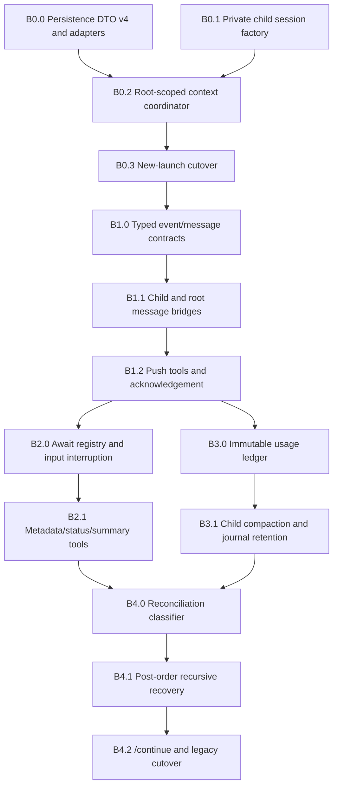

# M1 in-process child runtime implementation plan

Status: accepted plan; implementation not started.

M1 replaces new subprocess/FIFO child execution with private in-process Pi SDK `AgentSession` contexts. It preserves the current role hierarchy and model-facing workflow while changing runtime topology, delivery, context boundaries, accounting, and recovery.

M1 consists of B0–B4. B0 and B1 are sequential foundations; B2 and B3 may proceed in parallel after B1; B4 closes the milestone.



## Accepted defaults

1. Every newly launched child is an in-process private SDK context.
2. Legacy subprocess records are inspect/cancel/recovery-only. A replacement never starts until the old process and mutations are proved quiescent.
3. Private child journals remain file-backed while work is resumable, blocked, or incidented.
4. Clean objective closure deletes raw child journals and retains bounded reports, events, receipts, and usage. Incident/recovery custody retains journals.
5. Custom messages entering model context use `display: false`. Questions, terminal reports, and incidents are projected separately in concurrency UI; status and continuation traffic stays quiet.
6. Delivery means the custom message is durably appended. Terminal collection additionally requires explicit parent acknowledgement.
7. M1 adds no Pi-Tai active-turn cap. Provider behavior and file/workspace ownership supply backpressure. Telemetry may justify a scheduler later.
8. Pi-Tai's immutable side ledger is authoritative for child attribution. Native Pi totals remain informational.
9. Root-turn abort does not cancel children. Explicit `cancel_child` ends only that execution cycle and preserves workspace custody.
10. `/continue` reconciles descendants post-order, then parents, then the root.
11. One unresolved blocking question is permitted per child execution cycle.
12. `/continue` remains a visible prompt template whose first semantic action is deterministic `reconcile_children`; the coordinator sends quiet hidden continuation messages.

## Scope and non-goals

M1 owns:

- private SDK child session creation and disposal;
- parent/child topology and execution-cycle state;
- typed push events and parent instructions;
- acknowledgement and bounded context projection;
- wait interruption;
- child compaction, usage, restart, and continuation;
- migration/cutover from new subprocess launches.

M1 does not implement:

- shared-source file-set queues or deterministic JJ checkpoint tools;
- isolated workspace allocation/checkpoint/rebase/integration;
- reviewer or repair workflows;
- final deletion of all legacy subprocess code (F4);
- publication, fetch, bookmarks, or remote policy;
- a provider-turn scheduler.

Workspace custody remains independent. M1 may carry existing workspace attachments through records, but later C/D/E slices replace their lifecycle semantics.

## Runtime architecture

```text
root Pi extension instance
└── ChildContextCoordinator (one per root session)
    ├── durable context/event/usage stores
    ├── root ExtensionAPI bridge
    ├── ChildSessionFactory
    │   └── private AgentSession per active child
    │       ├── private SessionManager directory
    │       ├── child-specific ResourceLoader
    │       ├── exact model, role tools, cwd, and instructions
    │       ├── protocol bridge extension
    │       └── independent SettingsManager/compaction
    ├── active await registry
    └── reconciliation service
```

The coordinator is root-scoped, not process-global. Multiple visible root sessions may coexist without sharing child trees, waits, event queues, or attribution.

### Private persistence layout

Retain the existing managed state root and add context-specific directories:

```text
<agentDir>/pi-tai/subagents/
├── delegations/                 # versioned durable context DTOs
├── contexts/<context-id>/
│   └── sessions/                # private Pi SessionManager files
└── artifacts/<context-id>/      # bounded reports/large summary artifacts
```

These session directories are never passed to normal root `SessionManager.list()` or `listAll()`. They have no session-navigation command or UI entry action.

Exact managed-path constructors and Guardian policy own cleanup. Models never provide journal paths.

### SDK service composition

Each child receives:

- its own `AgentSession`, `SessionManager`, `SettingsManager`, and `ResourceLoader`;
- the selected provider/model and role thinking level;
- only the role's exact tools and allowed child roles;
- its assigned source or isolated cwd;
- a private protocol extension factory;
- Pi-Tai auto-compaction registration using the current root config service;
- headless extension UI with no interactive dialogs;
- no normal root footer, themes, keybindings, notifications, response editor, session title, or user session commands.

The root model runtime/auth registry may be shared as SDK infrastructure. Conversation state, tool exposure, settings, journals, queues, and subscriptions are never shared.

## Durable model

### Persistence DTO v4

Version 4 is a compatibility DTO, not the internal domain model. It records:

- context/root/parent semantic IDs;
- durable intent and exact agent-definition snapshot;
- cwd kind and managed workspace reference when present;
- current execution-cycle state;
- private session file reference;
- event IDs and delivery/acknowledgement state;
- usage-entry IDs and attribution markers;
- resumability/cancellation/incident disposition;
- created/updated/closed timestamps;
- legacy source metadata when migrated.

DTO parsing returns either a strict `ChildContextRecord` or a quarantine reason. Optional fields do not encode lifecycle state.

### Context and execution cycles

A child context represents durable delegated intent. An execution cycle represents one concrete SDK session run or linked replacement.

```text
context
├── cycle 1: interrupted
├── cycle 2: completed
└── immutable events/usage attributed to their originating cycle
```

Terminal cancellation closes only the current cycle. A later retry is a new explicitly linked cycle, never mutation of the cancelled cycle.

### Runtime-only state

Never persisted as live authority:

- `AgentSession` object;
- extension bridge object;
- subscriptions and abort controllers;
- active await promises;
- file/workspace lock ownership;
- FIFO queue position;
- in-flight provider stream identity.

Restart converts active runtime claims into durable `interrupted` evidence before any replacement.

## Typed message protocol

### Child-to-parent events

```ts
type ChildEvent =
  | { kind: "question"; eventId; contextId; cycleId; question; options; recommendation? }
  | { kind: "status"; eventId; contextId; cycleId; requestId; summary; completed; current?; remaining; blockers }
  | { kind: "terminal"; eventId; contextId; cycleId; outcome; summary; validation; changedFiles; concerns }
  | { kind: "incident"; eventId; contextId; cycleId?; reason; recoveryDisposition };
```

Heartbeat and liveness observations remain coordinator metadata; they do not enter parent model context.

### Parent-to-child messages

```ts
type ParentMessage =
  | { kind: "instruction"; messageId; contextId; cycleId; content }
  | { kind: "question_response"; messageId; contextId; cycleId; questionEventId; content }
  | { kind: "status_request"; messageId; contextId; cycleId; requestId; focus?; questions? }
  | { kind: "continue"; messageId; contextId; cycleId; reconciliationSummary };
```

All payloads have explicit byte/item caps before persistence or message injection. Oversized details become managed artifacts referenced by bounded summaries.

### Delivery lifecycle

```text
created
→ persisted
→ delivered       # custom message durably appended to target journal
→ acknowledged    # explicit parent ack where required
```

A failed append remains persisted/undelivered and is retryable by event ID. Redelivery never creates a new semantic event. Status events may coalesce only before delivery and only under a recorded supersession relation.

Terminal context state and terminal event acknowledgement are distinct. Parent settlement requires every direct child terminal and its terminal event acknowledged.

### Pi custom-message policy

- `customType` uses versioned Pi-Tai protocol names.
- `display: false` for all protocol context messages.
- questions, terminal events, and incidents use `deliverAs: "steer"` and `triggerTurn: true`;
- status responses steer an active requester or trigger an idle requester;
- continuation messages use `deliverAs: "steer"`, `triggerTurn: true`, and remain quiet;
- no protocol path calls `sendUserMessage()` or creates a user-role message.

Structured UI reads the event store rather than rendering hidden custom messages.

## Tool behavior

### Launch and topology

`spawn_child` and `spawn_workspace_child` call the coordinator. The coordinator validates the role edge, persists context intent before session creation, starts one execution cycle, then returns a bounded launch receipt. Launch is never completion.

A child coordinator view is injected into each private child bridge. It can create only roles permitted by its immutable agent-definition snapshot. Parent links always use semantic context IDs.

### Messaging and acknowledgement

- `message_child` sends a bounded typed instruction to the active cycle.
- `message_parent` persists and pushes a typed event.
- `ack_child_event` acknowledges one delivered event idempotently.
- answering a question references exactly the one unresolved question event.
- a second blocking question is rejected until the first is answered or its cycle terminates.

### Status and summaries

- `child_status` reads coordinator metadata only and spends no model turn.
- `request_child_status` asks for the standard bounded semantic status shape.
- `request_child_summary` adds one bounded focus and bounded explicit questions.
- status/summary requests are correlated events; they never read the child journal from the parent.
- after responding, the child receives a quiet continuation instruction and resumes saved work.

### Awaiting

`await_child_event` registers one runtime-only waiter for the calling context and selected children/events. Push delivery resolves it without polling.

The root extension input hook checks for an active await before normal Pi input processing:

1. resolve the waiter with `reason: "user_input"`;
2. do not consume or transform the user's input;
3. allow Pi's normal steer/follow-up behavior to proceed;
4. leave all children running.

Outside an active `await_child_event`, the hook performs no action.

### Cancellation

- root prompt/turn abort leaves children running;
- `cancel_child` aborts the selected active SDK session/cycle and waits for settlement;
- cancellation recursively affects descendants only when explicitly requested by the tool input;
- workspace custody and durable reports remain;
- cancelled cycles are terminal and excluded from automatic `/continue` recreation;
- process shutdown/restart is interruption, not cancellation.

## Usage ledger

The side ledger stores immutable intrinsic entries keyed by semantic usage event ID, child context, execution cycle, provider, model, and role.

```ts
type UsageLedgerEntry = {
  usageEventId;
  contextId;
  cycleId;
  provider;
  model;
  role;
  messageId;
  input;
  output;
  cacheRead;
  cacheWrite;
  cost;
};
```

Collection uses attributable SDK message/usage events where available. If a provider lacks per-message telemetry, the coordinator records a cycle-bound settled delta with an explicit attribution-quality marker. Missing telemetry warns but does not fabricate numbers.

Rules:

- write each intrinsic entry once;
- parent event delivery and acknowledgement never add usage;
- subtree totals sum immutable entries, not parent snapshots;
- native root totals are informational and may not include private contexts correctly;
- `concurrency_usage` groups by provider/model, role, context, and cycle and reports missing/unattributed telemetry.

## Child compaction and journal retention

The private bridge registers existing Pi-Tai automatic compaction against the same config service as the root, currently enabled at 90%. Each child has an independent in-progress guard and usage threshold.

Compaction:

- runs only when that child is idle/settled;
- writes its summary into that child's private journal;
- survives reopen/restart through normal Pi session persistence;
- never copies child history into the parent;
- emits bounded success/failure metadata for diagnostics;
- does not change lifecycle or event acknowledgement.

On clean objective closure, exact cleanup removes raw context session directories after proving:

- no active/recoverable cycle remains;
- all terminal events are acknowledged;
- intrinsic usage has been snapshotted;
- workspace custody is closed or independently retained;
- bounded reports/receipts needed for UI and recovery are durable.

Incident, blocked, unknown-partial-mutation, or unintegrated-workspace states retain journals.

## Restart and `/continue`

### Reconciliation classifier

For every persisted context/cycle, classify:

```text
terminal                 → do not recreate
cancelled                → do not recreate
incident/mutation-stop   → preserve and report
live SDK object present  → retain
legacy subprocess live   → inspect/cancel only; never duplicate
interrupted read-only    → safe to recreate/reissue
interrupted mutation     → reconcile receipt/JJ state first
resumable and quiescent  → create linked replacement cycle
ambiguous quiescence     → stop affected writer
```

### Post-order traversal

`reconcile_children` traverses durable topology, not currently live objects:

1. load and validate the context tree;
2. clear runtime waiters, subscriptions, and lock/queue authority;
3. recursively reconcile deepest descendants;
4. persist each descendant disposition;
5. reconcile/recreate its parent only after descendant states are known;
6. send the recreated parent one quiet `continue` custom message containing bounded descendant dispositions;
7. finish at the root with a bounded reconciliation report.

Writers reacquire file/workspace authority through later deterministic coordinators before mutation. Old queue positions are never restored.

### `/continue`

The visible prompt template instructs the root to call `reconcile_children` first. It does not itself encode recovery policy. After deterministic reconciliation, the root receives the bounded report and continues the user's objective. Recreated child agents receive hidden typed continuation messages, not user-role prompts.

## Legacy cutover

### New launch rule

Once B0.3 is enabled, `spawn_child` creates only in-process contexts. There is no runtime fallback to `PiChildProcessLauncher` after a failed SDK launch.

### Version-3 records

- terminal records remain inspectable through compatibility projection;
- live PID records are never assumed dead from missing coordinator objects;
- explicit cancellation may terminate an exact verified legacy process;
- replacement requires OS/process quiescence plus mutation reconciliation;
- ambiguous live writers remain mutation-stopped;
- legacy raw logs are never projected into parent model context;
- workspace custody remains preserved.

The old launcher/control parser remains isolated for legacy recovery until F4. New records never write PID, FIFO, prompt-file, or transcript-log authority.

## Implementation slices

### B0.0 — Persistence DTO v4 and adapters

**Changes**

- Add explicit v4 child context/event/cycle DTOs.
- Add DTO↔strict-domain conversion and quarantine.
- Add compatibility projection for v3 list/inspect.
- Add exact private context path constructors.

**Tests**

- v4 round trip;
- invalid field/state quarantine;
- v3 terminal projection;
- v3 running writer remains unproved;
- path traversal/symlink cleanup rejection.

**Checkpoint:** `refactor(subagents): add child context persistence v4`

### B0.1 — Private child session factory

**Changes**

- Productionize the M0 SDK spike behind `ChildSessionFactory`.
- Compose exact model/tools/cwd/system prompt/private session manager.
- Register only protocol bridge and child compaction features.
- Bind headless extension context and subscriptions.
- Return a disposable runtime handle; never persist the handle itself.

**Tests**

- exact role resources;
- concurrent sessions;
- private session listing exclusion;
- reopen, abort, dispose isolation;
- extension/resource errors become typed launch failures.

**Checkpoint:** `feat(subagents): add private child session factory`

### B0.2 — Root-scoped context coordinator

**Changes**

- Add create/get/list/tree/start/cancel/dispose APIs.
- Persist intent before starting a cycle.
- Enforce parent role edges and one active cycle per context.
- Keep runtime handles in a root-scoped map.
- Separate child execution from workspace custody.

**Tests**

- nested topology;
- launch failure custody;
- duplicate active-cycle rejection;
- cancellation and root disposal semantics;
- two visible roots cannot observe each other's children.

**Checkpoint:** `feat(subagents): add in-process child context coordinator`

### B0.3 — New-launch cutover

**Changes**

- Route new `spawn_child` calls through coordinator/session factory.
- Stop creating PID/FIFO/log/prompt artifacts for new records.
- Keep v3 launcher only behind explicit legacy recovery paths.
- Preserve current model-facing launch receipts during transition.

**Tests**

- no subprocess/spawn/FIFO call on new launch;
- SDK launch failure does not fall back;
- legacy terminal record remains inspectable;
- unproved legacy writer blocks replacement.

**Checkpoint:** `refactor(subagents): cut new children over to SDK contexts`

### B1.0 — Typed event/message contracts

**Changes**

- Add bounded protocol DTOs, IDs, correlation, and reducers.
- Add persisted→delivered→acknowledged event lifecycle.
- Enforce one unresolved blocking question per cycle.
- Add managed artifact references for oversized details.

**Tests**

- exhaustive state transitions;
- byte/item bounds;
- duplicate delivery/ack idempotency;
- stale response rejection;
- status supersession rules.

**Checkpoint:** `feat(subagents): add typed child event protocol`

### B1.1 — Child and root message bridges

**Changes**

- Capture root and child `ExtensionAPI` bridges.
- Persist before custom-message append.
- Use hidden custom messages with correct steer/trigger behavior.
- Retry undelivered events by semantic ID.
- Project visible UI state from event store.

**Tests**

- active parent steer;
- idle parent trigger;
- parent→child instruction;
- no user-role protocol messages;
- append failure/redelivery;
- bounded UI projection.

**Checkpoint:** `feat(subagents): push typed events across SDK contexts`

### B1.2 — Push tools and acknowledgement

**Changes**

- Implement `message_child`, `message_parent`, `ack_child_event`, and question response over protocol.
- Replace transcript/result collection with event acknowledgement.
- Gate parent settlement on terminal+acknowledged direct children.
- Keep compatibility aliases temporarily.

**Tests**

- question/response correlation;
- terminal exactly once;
- acknowledgement after delivery only;
- parent cannot complete with unacknowledged terminal child;
- no child-history reads.

**Checkpoint:** `feat(subagents): acknowledge pushed child events`

### B2.0 — Await registry and input interruption

**Changes**

- Add runtime-only wait registry per calling context.
- Resolve on matching pushed event, timeout, cancellation, or user input.
- Add root input hook that interrupts only active waits.
- Remove polling from new await behavior.

**Tests**

- wait-any event wake;
- immediate user interruption with input preserved;
- normal steering unchanged outside wait;
- child remains active;
- root replacement clears waiters.

**Checkpoint:** `feat(subagents): add interruptible child event waits`

### B2.1 — Metadata, status, and focused summaries

**Changes**

- Implement metadata-only `child_status`.
- Implement correlated standard/focused status requests.
- Bound focus, questions, response fields, and artifacts.
- Quietly resume child activity after status response.

**Tests**

- zero-model metadata status;
- focused request bounds;
- status does not terminate cycle;
- stale request correlation;
- no transcript/history access.

**Checkpoint:** `feat(subagents): add bounded child status summaries`

### B3.0 — Immutable usage ledger

**Changes**

- Subscribe to attributable SDK usage/message events.
- Persist immutable per-context/cycle/model entries.
- Add attribution-quality marker and settled-delta fallback.
- Implement exact subtree aggregation and `concurrency_usage`.

**Tests**

- mixed model/provider children;
- nested subtree total;
- duplicate SDK event dedupe;
- acknowledgement does not add usage;
- missing telemetry warning.

**Checkpoint:** `feat(subagents): add root-scoped child usage ledger`

### B3.1 — Child compaction and retention

**Changes**

- Register existing 90% Pi-Tai compaction for each child bridge.
- Persist/reopen compacted private journals.
- Add clean-closure journal cleanup and incident retention.
- Preserve bounded reports/receipts/usage before deletion.

**Tests**

- independent thresholds/in-progress guards;
- one child's compaction does not affect siblings/root;
- reopen compacted journal;
- clean closure deletes only exact private path;
- incident/unintegrated custody retains journal.

**Checkpoint:** `feat(subagents): compact and retain private child journals`

### B4.0 — Reconciliation classifier

**Changes**

- Classify terminal/cancelled/incident/live/interrupted/legacy states.
- Add quiescence proof interface.
- Reconcile interrupted read-only versus mutation operations.
- Clear runtime-only authority on root replacement.

**Tests**

- exhaustive classifier table;
- old writer ambiguity;
- completed receipt synthesis;
- safe read reissue;
- unknown mutation stop.

**Checkpoint:** `feat(subagents): classify resumable child contexts`

### B4.1 — Post-order recursive recovery

**Changes**

- Traverse complete durable descendant tree post-order.
- Recreate only quiescent resumable cycles.
- Persist dispositions before parent continuation.
- Deliver bounded descendant summaries to recreated parents.

**Tests**

- three-level recovery order;
- terminal/cancelled exclusion;
- unanswered question restoration;
- no duplicate writer;
- partial subtree incident does not block unrelated subtree.

**Checkpoint:** `feat(subagents): reconcile child trees post-order`

### B4.2 — `/continue` and legacy cutover completion

**Changes**

- Update visible prompt template to call `reconcile_children` first.
- Send quiet typed continuation messages to recreated contexts.
- Surface bounded reconciliation report to root/user UI.
- Restrict old subprocess launcher to explicit legacy paths.

**Tests**

- prompt contract;
- descendant-first continuation;
- restart clears waits/locks/queues;
- legacy live process never duplicated;
- root resumes after reconciliation report.

**Checkpoint:** `feat(subagents): resume reconciled context trees`

## Source migration map

| Current area | M1 disposition |
|---|---|
| `subagents/store.ts` | Keep persistence entry point; add v4 DTO adapter or split DTO codec from strict domain |
| `subagents/launcher.ts` | Replace for new work with private session factory; retain exact legacy recovery functions |
| `subagents/orchestrator.ts` | Thin compatibility facade over `ChildContextCoordinator` during cutover |
| `subagents/register.ts` | Register coordinator-backed tools, root bridge, input hook, and compatibility aliases |
| `subagents/ui.ts` | Replace transcript reads with event/report/usage projections; preserve hierarchy/navigation |
| `subagents/domain.ts` | Keep command/role composition temporarily; move lifecycle/protocol facts to strict concurrency domain |
| `concurrency/domain.ts` | Extend M0 strict types with event delivery, cycles, and recovery dispositions |
| `compaction/register.ts` | Reuse as child-specific registrar with supplied config and headless diagnostics |

No big-bang file rename is required. Behavior moves behind strict interfaces first; obsolete subprocess/transcript code is deleted only after parity and migration evidence.

## Acceptance matrix

| Capability | Model-free | SDK integration | Persistence/restart |
|---|---:|---:|---:|
| Private concurrent sessions | factory contract | required | reopen required |
| Typed push and idle trigger | reducer/bridge fake | required | undelivered retry |
| No user impersonation | schema contract | message-role assertion | journal assertion |
| Terminal acknowledgement | reducer | required | restore pending ack |
| Wait interruption | waiter unit | root input integration | waiters cleared |
| Focused summaries | bounds/correlation | fake-model request | persisted event only |
| Usage exactly once | ledger unit | mixed-model SDK | reopen aggregation |
| 90% child compaction | policy unit | independent child sessions | compacted reopen |
| Cancellation isolation | coordinator unit | sibling SDK proof | cancelled excluded |
| Recursive `/continue` | classifier/tree unit | quiet custom messages | post-order recreation |
| Legacy writer safety | migration/quiescence fake | no SDK duplicate | v3 fixture |
| Journal cleanup | path-policy unit | disposal proof | incident retention |

Normal correctness gates are domain/unit, fake-session/coordinator, fake-model SDK, persistence/restart, typecheck, package contract, and isolated package smoke. Live-model evals remain opt-in and non-gating.

## M1 milestone exit

M1 is complete only when:

1. every new child launch is an in-process private SDK context;
2. nested child events push to active/idle parents without user-role messages;
3. parent context receives only bounded events/status/summaries;
4. terminal events require explicit acknowledgement;
5. user input interrupts only `await_child_event`;
6. child compaction and usage attribution are independent and durable;
7. explicit cancellation preserves sibling work and workspace custody;
8. root restart reconciles descendants post-order and never duplicates a writer;
9. `/continue` invokes deterministic reconciliation then resumes with quiet typed messages;
10. legacy subprocess records remain safely inspectable/recoverable but no new subprocess child is created;
11. full deterministic tests and isolated package smoke pass.

M1 does not require deleting the legacy launcher. F4 removes it after later JJ/workspace/review slices no longer depend on compatibility behavior.
