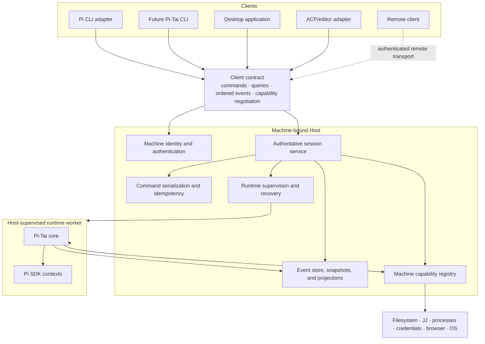

# System architecture

Storage implementation status: [Durable storage](STORAGE.md).

## End-state model

Pi-Tai separates reusable behavior, machine authority, execution, and presentation.



## Authority boundaries

| Concern | Authority |
|---|---|
| Product session identity and lifecycle | Host session service |
| Ordered commands, events, revisions, and replay | Host |
| Agent/session behavior | Pi-Tai core |
| Live model contexts and tool execution | Host-supervised runtime worker |
| Child topology and semantic lifecycle | Core, persisted through Host |
| Machine identity and client authentication | Host |
| Filesystem, JJ, process, browser, and credential access | Host capability adapters |
| Guardian decision policy | Core; Host enforces capability boundary |
| Terminal/desktop/editor presentation | Client |
| Viewport, keybindings, and unsent drafts | Client-local |

## Required dependency direction

```text
clients and protocol adapters
              ↓
typed client contract
              ↓
Host application services
              ↓
Pi-Tai core interfaces
              ↓
persistence, Pi SDK, JJ, filesystem, process, and network adapters
```

Forbidden directions:

- core importing terminal or desktop presentation;
- clients opening the canonical database directly;
- protocol DTOs becoming persistence entities;
- runtime workers independently assigning product session identity;
- Host crates reimplementing agent policy already owned by core;
- models constructing raw JJ mutation commands or unrestricted revsets;
- remote clients receiving ambient machine-resource access.

## Process topology

A typical machine runs:

```text
Pi-Tai Host
├── local IPC server
├── session actors/services
├── SQLite event/snapshot store
├── runtime supervisor
│   └── TypeScript runtime worker(s)
│       ├── one or more root Pi SDK contexts
│       └── private child Pi SDK contexts
└── capability adapters

separate clients
├── Pi CLI process
├── desktop UI process
└── ACP shim process
```

Process boundaries are deployment decisions, not domain boundaries. The core must remain testable in-process. The Host may isolate runtime workers for crash containment and packaging, but their state is subordinate to Host persistence.

## Data flow

### Command

```text
client command + operation ID + expected revision
→ authenticate client and authorize session access
→ session actor validates current state
→ persist accepted command/state transition
→ dispatch deterministic intent to runtime/core
→ persist emitted events, usage, receipts, and artifacts
→ publish ordered projections to attached clients
```

### Reconnect

```text
client presents session ID + last event cursor
→ Host validates attachment
→ replay canonical projection after cursor
→ cross replay high-water mark
→ release buffered live events
→ continue duplicate-free stream
```

### Runtime recovery

```text
worker disappears
→ Host marks runtime health interrupted
→ durable foreground state settles honestly
→ supervisor proves old writer quiescent
→ worker/core reconstruct from Host state and private journals
→ session becomes resumable or attention_required
```

## Single-machine to multi-machine

The local Host is the first server boundary.

1. **Local:** clients connect over authenticated local IPC.
2. **Remote client:** transport changes to authenticated encryption; the same command/event semantics remain.
3. **Several Hosts:** a client or control plane selects a Host; every session has one home Host.
4. **Session movement:** a separate future protocol transfers writer leases, event state, artifacts, workspaces, and capability requirements. It is not implied by remote attachment.

See [Clients and protocols](CLIENTS.md) and [Sessions and persistence](SESSIONS.md).
