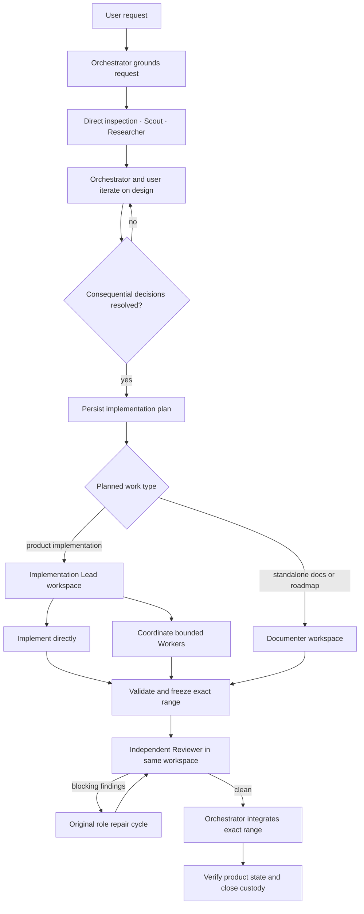

# Agent concurrency

## Purpose

The concurrency subsystem coordinates Design–Plan–Implement–Closure, private child contexts, isolated JJ workspaces, parent/child messages, independent review, integration, recovery, and recursive accounting.

Its output is one of:

- a resolved design or roadmap decision;
- reviewed, integrated, and verified repository changes;
- a proved no-change result;
- a bounded user decision request;
- an `attention_required` handoff with preserved evidence.

It does not own publication, remote bookmarks, user JJ configuration, destructive recovery, or Host/client session arbitration.

## Workflow

The Orchestrator chooses a proportionate workflow. Large or consequential requests use codebase-grounded DPIC and become large work orders only after consequential ambiguity is resolved. Small, clear requests become small work orders directly. Both persist complete effective implementation and validation instructions without a separate approval ceremony.

## Roles

| Role | Owns | May delegate | Workspace authority |
|---|---|---|---|
| **Orchestrator** | User collaboration, grounded design when needed, work-order sizing and routing, review disposition, integration, final verification | Worker, Implementation Lead, Documenter, Reviewer, Scout, Researcher | Exclusive main orchestration workspace; create, review, integrate, close child workspaces |
| **Implementation Lead** | One large product work order and its complete delivery | Worker, Scout, Researcher | Implement or coordinate within one dedicated workspace; never create or integrate workspaces |
| **Worker** | One small bounded product work order | Scout, Researcher | Dedicated workspace when launched by the Orchestrator; assigned target and file set when launched by an Implementation Lead |
| **Documenter** | One standalone documentation work order | None | Explicit Markdown documentation paths in one dedicated workspace |
| **Reviewer** | Independent verification against current intent and exact frozen range | Scout, Researcher | Read-only in the implementation workspace |
| **Scout** | Repository evidence | None | Read-only view of caller workspace |
| **Researcher** | Current external and repository evidence | None | Read-only view of caller workspace |

Small bounded product work goes directly to a Worker; large product work goes to an Implementation Lead. Documentation accompanying product code remains with its product role; Documenter is for standalone documentation changes.

## Work-order authority

`work_order_create` creates `small-product`, `large-product`, and `documentation` work orders. A work order combines objective, constraints, acceptance criteria, effective implementation and validation instructions, and a selected execution role under one durable authority. The role is the durable routing fact: Worker represents small product work and Implementation Lead represents large product work. Instructions have append-only revisions with one current effective revision. Later revisions remain visible as provenance and make existing review snapshots stale, while already queued work remains in custody for redirection, repair, or re-review. Children receive a self-contained task packet and immutable work-order snapshot rather than parent conversation history.

## Workspace invariants

1. The Orchestrator owns the main workspace for investigation, immediate one-step work, orchestration, integration, reconciliation, and verification.
2. Multi-step writable work runs in a managed JJ workspace selected by its execution class.
3. Integration conflicts enter bounded custody while the Orchestrator reconciles them with Bash/JJ and records focused-review evidence.
4. Direct Workers own a dedicated workspace; Workers delegated by an Implementation Lead share its workspace under disjoint file-set ownership. Nested workspaces are forbidden.
5. Documenters can modify only assigned documentation paths.
6. Every nonempty delegated range receives independent review in that same workspace before integration.
7. Repair resumes through the original workspace role, followed by focused re-review.
8. Integration, verification, and closure remain Orchestrator-only deterministic operations.

## Parent/child communication

- Children push typed questions, terminal results, status responses, and incidents.
- Parents receive bounded reports, never transcripts or raw tool streams.
- `await_child_event` is an optional token-free barrier, not polling.
- Every terminal report is delivered and acknowledged exactly once.
- Delegation is not completion: a parent cannot settle with unresolved or unacknowledged direct children.

See [Runtime](RUNTIME.md).

## Completion

| Actor/artifact | Complete means |
|---|---|
| Scout/researcher | Terminal evidence report acknowledged |
| Worker | Assigned paths checkpointed, validation reported, terminal event acknowledged |
| Implementation Lead | Descendants acknowledged, complete assigned task validated, history curated and frozen; still review-pending |
| Documenter | Assigned documentation validated and frozen; still review-pending |
| Reviewer | Structured findings delivered and acknowledged |
| Delegated workspace | Reviewed, integrated, verified, and custody closed or proved no-change |
| Orchestrator | Current intent delivered; every child acknowledged and every workspace closed or honestly mutation-stopped |

## Normative documents

- [Runtime](RUNTIME.md)
- [JJ coordination](JJ.md)
- [State machines](STATE-MACHINES.md)
- [Agents and tools](TOOLS.md)
- [Failure and recovery](RECOVERY.md)
- [Testing](TESTING.md)
