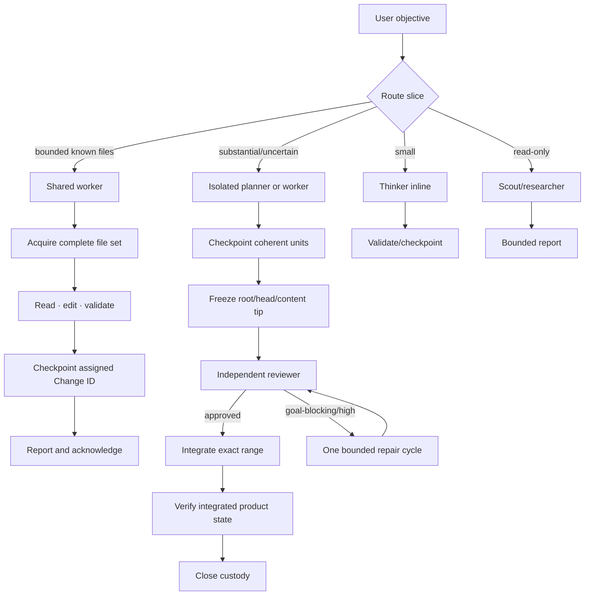

# Agent concurrency

## Purpose

The concurrency subsystem coordinates concurrent agents and the work they produce. It owns role selection, task ownership, private child contexts, shared-file coordination, isolated JJ workspaces, parent/child messages, review, integration, recovery, and recursive accounting.

Its output is one of:

- a verified inline result;
- reviewed, integrated, and verified feature changes;
- a proved no-change result;
- a bounded user decision request;
- an `attention_required` handoff with preserved evidence.

It does not own publication, remote bookmarks, user JJ configuration, destructive recovery, or Host/client session arbitration.

## Execution lanes

| Lane | Use when | Writer model | JJ shape |
|---|---|---|---|
| **Inline** | Small, sequential work cheaper to perform directly | Thinker | Main private orchestration change; material work checkpointed deterministically |
| **Shared** | Bounded implementation with a known complete file set | Queued thinker/worker | Assigned inserted feature Change ID; atomic edit→validate→checkpoint critical section |
| **Isolated** | Substantial, parallel, overlap-prone, uncertain, or explicitly isolated work | One planner/worker at a time | Separate JJ workspace from source `@-`; reviewed exact Change-ID range |

Read-only scouts, researchers, and reviewers may run concurrently without write claims.

### Routing

1. Read-only repository evidence → scout.
2. Current external evidence → researcher.
3. Small direct work → thinker inline.
4. Bounded work with known files → shared worker.
5. Substantial decomposition → isolated planner.
6. Bounded but uncertain/explicitly isolated → isolated worker.
7. Independent slices → separate isolated workspaces.
8. Related slices sharing evolving code → one sequential owner.
9. Every nonempty isolated range → independent reviewer before integration.
10. Scope expansion → checkpoint/release current ownership, then acquire a wider set or reroute.

## Roles

| Role | Owns | May delegate | Workspace authority |
|---|---|---|---|
| **Thinker** | User intent, routing, task plan, final verification | Planner, worker, reviewer, scout, researcher | Create, review, integrate, close |
| **Planner** | One substantial isolated slice and its internal decomposition | Worker, scout, researcher | Checkpoint/freeze own workspace; never create/integrate |
| **Worker** | One bounded implementation | Scout, researcher | Assigned shared target or bounded isolated write; no lifecycle authority |
| **Reviewer** | Spec/task-plan verification against exact range | Scout, researcher | Read-only |
| **Scout** | Repository evidence | None | None |
| **Researcher** | External and repository evidence | None | None |

A planner is not a generic second thinker. A worker is not an open-ended planner. A reviewer reports findings but never launches a repair worker.

## Task ownership

Every child receives a self-contained packet:

- objective and relevant decisions;
- exact resources and cwd/workspace identity;
- writable scope or explicit read-only status;
- constraints and forbidden operations;
- acceptance criteria;
- expected report shape;
- uncertainty/question behavior;
- task-plan snapshot when relevant.

Children do not inherit parent conversation history. Authority derives from the packet, immutable role snapshot, tracked change/workspace assignment, and active coordination token.

## Core workflow

## Parent/child communication

- Children push typed questions, terminal results, status responses, and incidents.
- Messages are hidden custom Pi messages, never impersonated user messages.
- Parents receive bounded reports, never transcripts or raw tool streams.
- `await_child_event` is an optional token-free barrier, not polling.
- Every terminal report is delivered and explicitly acknowledged exactly once.
- Delegation is not completion: a parent cannot settle with unresolved or unacknowledged direct children.
- A user message interrupts only an active await; it does not cancel children.

See [Runtime](RUNTIME.md).

## Completion

| Actor/artifact | Complete means |
|---|---|
| Scout/researcher | Terminal evidence report acknowledged |
| Shared worker | Report acknowledged, claim released, checkpoint receipt accepted, caller validated |
| Planner | Descendants acknowledged, validation passed, history curated and frozen, report delivered; still review-pending |
| Reviewer | Structured findings delivered and acknowledged |
| Isolated slice | Reviewed, integrated, verified, and custody closed or proved no-change |
| Thinker | Every child acknowledged; every workspace closed, intentionally preserved, or honestly mutation-stopped; acceptance criteria verified |

## Normative documents

- [Runtime](RUNTIME.md)
- [JJ coordination](JJ.md)
- [State machines](STATE-MACHINES.md)
- [Agents and tools](TOOLS.md)
- [Failure and recovery](RECOVERY.md)
- [Testing](TESTING.md)
