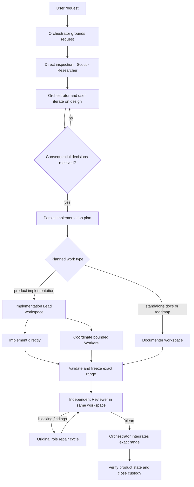

# Agent concurrency

## Purpose

The concurrency subsystem coordinates Design–Plan–Implement–Confirm, private child contexts, isolated JJ workspaces, parent/child messages, independent review, integration, recovery, and recursive accounting.

Its output is one of:

- a resolved design or roadmap decision;
- reviewed, integrated, and verified repository changes;
- a proved no-change result;
- a bounded user decision request;
- an `attention_required` handoff with preserved evidence.

It does not own publication, remote bookmarks, user JJ configuration, destructive recovery, or Host/client session arbitration.

## Workflow

The Orchestrator follows the codebase-grounded Design phase for implementation requests. It gathers evidence, presents material decisions and tradeoffs, and asks the user to resolve consequential ambiguity. It moves to Plan only when the intended outcome, repository behavior, boundaries, constraints, key decisions, and acceptance criteria are clear enough that implementation will not need to invent product or architectural intent. It then persists the complete effective plan and proceeds without a separate approval ceremony.

## Roles

| Role | Owns | May delegate | Workspace authority |
|---|---|---|---|
| **Orchestrator** | User collaboration, grounded design, effective plan, routing, review disposition, integration, final verification | Implementation Lead, Documenter, Reviewer, Scout, Researcher | Exclusive main orchestration workspace; create, review, integrate, close child workspaces |
| **Implementation Lead** | One plan-bound product task and its complete delivery | Worker, Scout, Researcher | Implement or coordinate within one dedicated workspace; never create or integrate workspaces |
| **Worker** | One bounded implementation assignment | Scout, Researcher | Assigned target and file set in the Implementation Lead workspace |
| **Documenter** | One plan-bound standalone architecture, design, documentation, or roadmap update | None | Explicit Markdown documentation paths in one dedicated workspace |
| **Reviewer** | Independent verification against current intent and exact frozen range | Scout, Researcher | Read-only in the implementation workspace |
| **Scout** | Repository evidence | None | Read-only view of caller workspace |
| **Researcher** | Current external and repository evidence | None | Read-only view of caller workspace |

The Orchestrator never launches a generic Worker. Small product work still goes to an Implementation Lead, which may implement directly. Documentation accompanying product code remains in that Implementation Lead workspace; Documenter is for standalone documentation changes.

## Task and plan authority

Every substantial request has one durable root task. Plans are append-only revisions with one current effective revision. Implementation Lead and Documenter assignments bind the current plan revision, digest, and user-direction count when queued; no user-approval receipt is required. Later plan revisions remain visible as provenance and make existing review snapshots stale, while already queued work remains in custody for the Orchestrator to redirect, repair, or re-review. Children receive a self-contained task packet and immutable task snapshot rather than parent conversation history.

## Workspace invariants

1. The main workspace is reserved for Orchestrator lifecycle operations and integration.
2. The Orchestrator cannot edit files or use shell mutation.
3. Every writable child starts in a dedicated managed JJ workspace.
4. Workers share their Implementation Lead's workspace under disjoint file-set ownership; nested workspaces are forbidden.
5. Documenters can modify only assigned documentation paths.
6. Every nonempty delegated range receives independent review in that same workspace before integration.
7. Repair resumes through the original workspace role, followed by focused re-review.
8. Integration, verification, and closure remain Orchestrator-only deterministic operations.

## Parent/child communication

- Children push typed questions, terminal results, status responses, and incidents.
- Parents receive bounded reports, never transcripts or raw tool streams.
- `await_child_event` is an optional token-free barrier, not polling.
- Every terminal report is delivered and acknowledged exactly once.
- Delegation is not completion: a parent cannot settle with unresolved or unacknowledged direct children.

See [Runtime](RUNTIME.md).

## Completion

| Actor/artifact | Complete means |
|---|---|
| Scout/researcher | Terminal evidence report acknowledged |
| Worker | Assigned paths checkpointed, validation reported, terminal event acknowledged |
| Implementation Lead | Descendants acknowledged, complete assigned task validated, history curated and frozen; still review-pending |
| Documenter | Assigned documentation validated and frozen; still review-pending |
| Reviewer | Structured findings delivered and acknowledged |
| Delegated workspace | Reviewed, integrated, verified, and custody closed or proved no-change |
| Orchestrator | Current intent delivered; every child acknowledged and every workspace closed or honestly mutation-stopped |

## Normative documents

- [Runtime](RUNTIME.md)
- [JJ coordination](JJ.md)
- [State machines](STATE-MACHINES.md)
- [Agents and tools](TOOLS.md)
- [Failure and recovery](RECOVERY.md)
- [Testing](TESTING.md)
