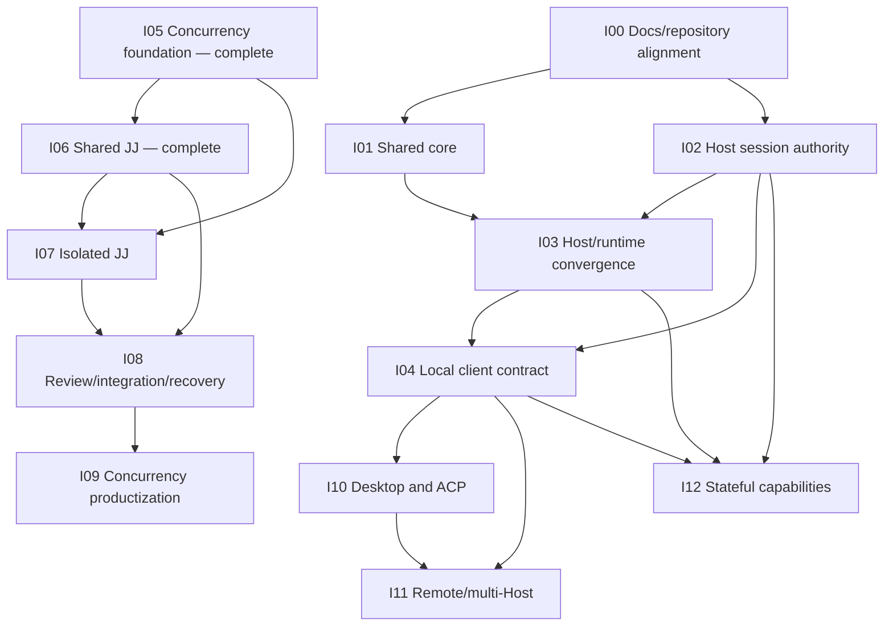

# Roadmap

## Purpose

The roadmap describes how the current repository converges on the end-state product and architecture. Unlike the rest of the documentation, roadmap files deliberately contain status, sequencing, migration constraints, and temporary compatibility work.

An initiative is a bounded product or architecture outcome. It may contain many implementation checkpoints. Initiative numbers provide a stable reading order, not a promise of strictly serial delivery.

## Status legend

- **Complete** — accepted outcome exists and dependents may rely on it.
- **In progress** — active implementation exists but exit outcome is not complete.
- **Planned** — designed enough to index; implementation has not started.
- **Exploratory** — outcome is desired but key product decisions remain.

## Initiative index

| ID | Initiative | Status | Depends on | End outcome |
|---|---|---|---|---|
| I00 | [Documentation and repository alignment](initiatives/I00-documentation-and-repository.md) | Planned | — | New docs become normative; top-level areas have explicit product status |
| I01 | [Extract the shared core](initiatives/I01-core-extraction.md) | Planned | I00 | Reusable behavior lives in `@pi-tai/core`; Pi CLI is an adapter |
| I02 | [Canonical Host sessions](initiatives/I02-host-session-authority.md) | In progress | I00 | Host is sole authority for durable sessions/events/replay |
| I03 | [Host/runtime convergence](initiatives/I03-host-runtime-convergence.md) | In progress | I01, I02 | Host-supervised worker embeds the same core; no competing session truth |
| I04 | [Local client contract and CLI cutover](initiatives/I04-local-client-contract.md) | Planned | I02, I03 | Pi CLI, desktop, ACP use one local client API |
| I05 | [Concurrency runtime foundation](initiatives/I05-concurrency-foundation.md) | Complete | — | Strict types, Real-JJ harness, private SDK children, push/recovery foundation |
| I06 | [Shared-source JJ concurrency](initiatives/I06-shared-jj.md) | Complete | I05 | Atomic file-set queues and deterministic WIP/feature checkpoints |
| I07 | [Isolated JJ execution](initiatives/I07-isolated-jj.md) | Planned | I05, I06 | Tracked workspace identity, checkpoint, rebase, freeze, and no-change proof |
| I08 | [Review, integration, and recovery](initiatives/I08-review-integration-recovery.md) | Planned | I06, I07 | Task-plan review gate, deterministic integration, conflict repair, recovery |
| I09 | [Concurrency productization](initiatives/I09-concurrency-productization.md) | Planned | I08 | Honest closure/UI/accounting and deletion of compatibility paths |
| I10 | [Desktop and ACP clients](initiatives/I10-desktop-acp.md) | In progress | I04 | Desktop manager and thin ACP adapter consume Host contract |
| I11 | [Remote and multi-Host access](initiatives/I11-remote-multihost.md) | Exploratory | I04, I10 | Authenticated remote clients with one home Host per session |
| I12 | [Stateful machine capabilities](initiatives/I12-machine-capabilities.md) | Exploratory | I02, I03, I04 | Browser/computer/image/cmux capabilities governed and persisted uniformly |

## Dependency graph

Concurrency/JJ and Host/core work can proceed in parallel. Their convergence point is persistence and runtime composition: child/context/workspace state must ultimately be persisted through Host-owned session services rather than a second standalone authority.

## Suggested delivery lanes

| Lane | Sequence |
|---|---|
| Documentation/repository | I00 → I01 |
| Host authority | I02 → I03 → I04 |
| Concurrency/JJ | I05 → I06 → I07 → I08 → I09 |
| Clients | I04 → I10 → I11 |
| Machine capabilities | {I02, I03, I04} → I12 |

## Migration rules

1. Preserve behavior behind interfaces before moving directories.
2. Keep one authoritative state owner during every cutover; mirroring is temporary and explicit.
3. Add protocol/persistence version adapters before deleting legacy records.
4. Do not combine broad repository moves with security-sensitive behavior changes.
5. Every initiative has independently testable exit outcomes.
6. Compatibility code has a named deletion initiative and no new callers.
7. Historical docs are removed only after their enduring decisions appear in the new normative set.
8. Generated outputs and obsolete archives are not retained merely because they once shipped.
